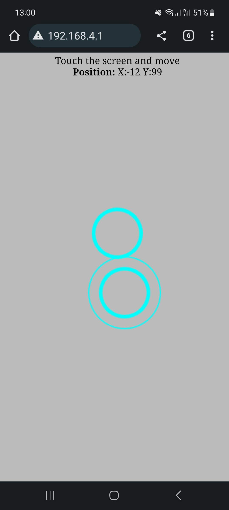
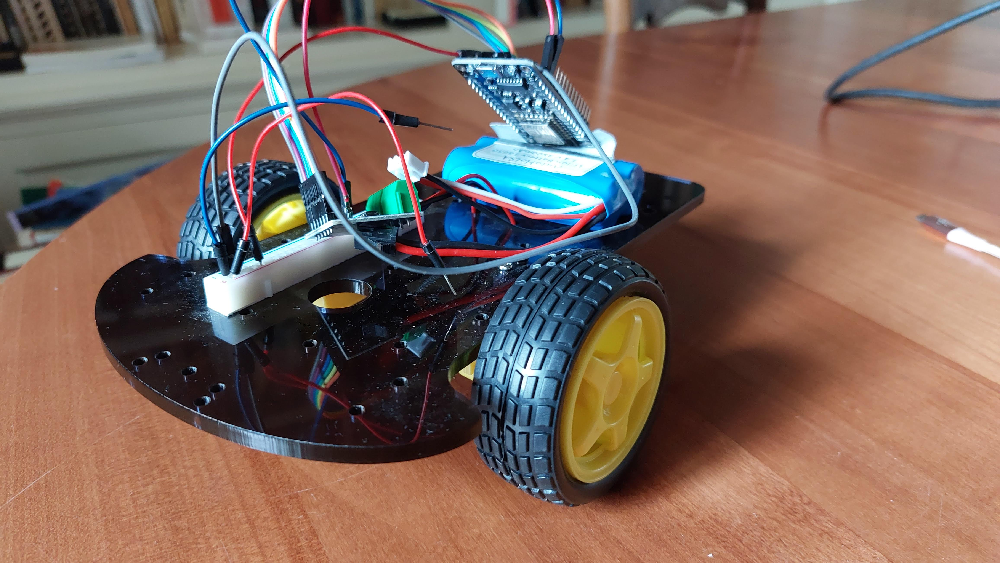

# esp8266_web_joystick
Web based joystick hosted on a ESP8266/NodeMCU to control a car.

ESP8266 will create an wifi access point. Once connected the page will be available at this address: 192.168.4.1

Click on the screen to see the joystick.

This project is based on this tutorial to set up a nice web based joystick : https://automatedhome.party/2017/07/15/wifi-controlled-car-with-a-self-hosted-htmljs-joystick-using-a-wemos-d1-miniesp8266/

It is also based on this project to turn the ESP8266 as an access point: https://www.hackster.io/16283/esp8266-mikroe-buggy-ccd102

## Hardware
- Robot car: any kit found on Aliexpress or Amazon with 6V yellow motors
- ESP8266 board: NodeMCU V3 (any other esp8266 based board should work)
- Battery: 7.4V 2S 18650 li-ion (any other battery should work if voltage is above 6V)
- Motor controller: L9110S (any other motor controller should work)

## Wiring
- Connect motor controller to NodeMCU:
  - L9110S B1-A -> NodeMCU D1
  - L9110S B1-B -> NodeMCU D2
  - L9110S A1-A -> NodeMCU D3
  - L9110S A1-B -> NodeMCU D4
  - L9110S GND -> NodeMCU GND
  - L9110S VCC -> NodeMCU VIN
- Connect battery:
  - Battery **-** -> NodeMCU GND
  - Battery **+** -> NodeMCU VIN

## Flash the software
- Connect your ESP8266 to the computer via USB (disconnect battery before)
- Push web code to the esp8266 using this tutorial: https://github.com/esp8266/arduino-esp8266fs-plugin
- Compile and upload the code to the ESP8266 with Arduino IDE
- Disconnect USB
  
## Connect to the robot
- Connect battery to turn on the robot
- Connect with your phone to the wifi created by the ESP8266
- On your phone: the password is: joystick
- Alternatively you can use this QR code to connect directly

- On your phone: browse to 192.168.4.1 in your browser or use QR code

  
- On your phone: click on the screen and you will see the joystick appearing
- You should see your car moving when moving the joystick around
- If the car is moving other way around, modify cabling or software

